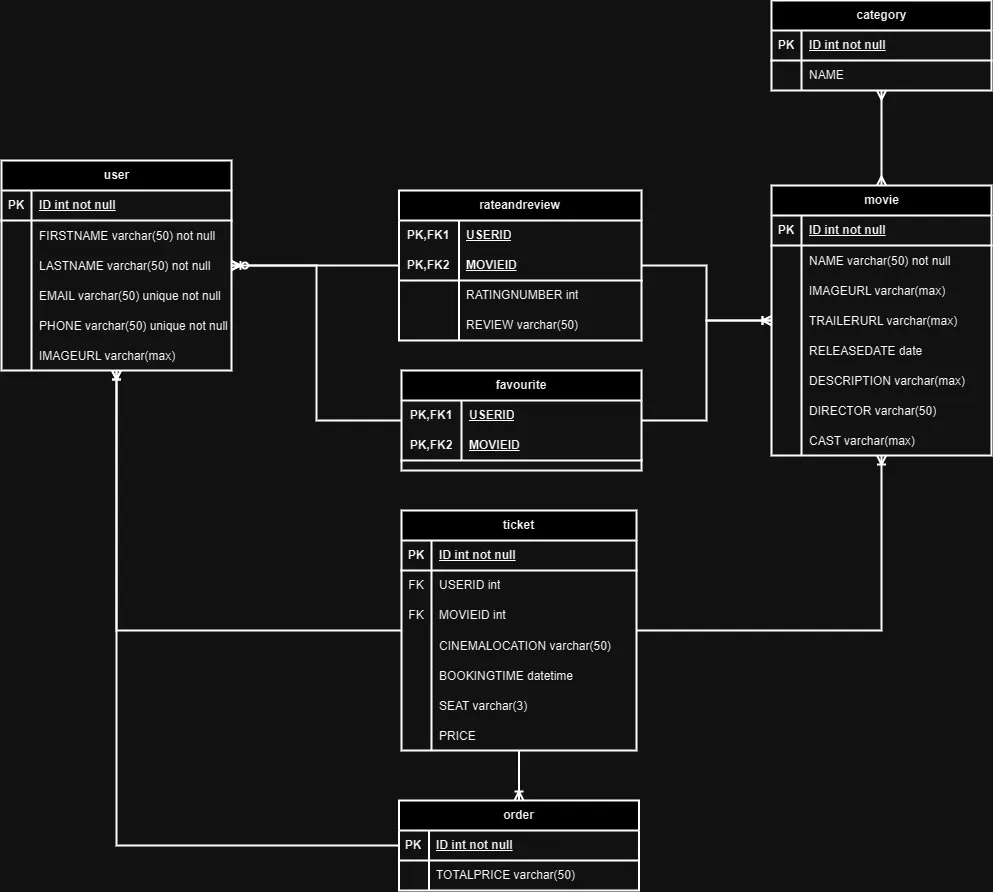

# Movie booking application

## Description

This is a movie booking application that allows users to book movie tickets online. The application is built using Hybrid platform (Ionic 3) and Supabase (Firebase alternative). 

## Features

- User can view list of movies
- User can view movie details
- User can book movie tickets
- User can view list of booked tickets

## Technologies

- Ionic 3
- Capacitor
- React 
- Typescript

## Tools

- Supabase

## Getting Started

### Dependencies

- NodeJS
- Ionic 3
- Supabase

### Installing

- Clone the repository
- Run `npm install` to install dependencies
- Run `ionic serve` to start the application
- If you want to run on android, run `ionic capacitor run android --livereload --external` to start the application
- If you want to run on ios, run `ionic capacitor run ios --livereload --external` to start the application

## Authors

- [Pham Quang Hoa](https://github.com/hoapham2k2)
- ...

## ERD

